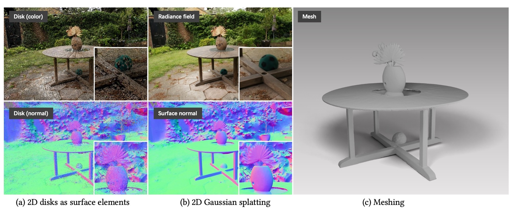

# 几何精确辐射场的二维高斯散射

[项目主页](https://surfsplatting.github.io/) | [论文](https://arxiv.org/pdf/2403.17888) | [视频](https://www.youtube.com/watch?v=oaHCtB6yiKU) | [Surfel光栅化器(CUDA)](https://github.com/hbb1/diff-surfel-rasterization) | [Surfel光栅化器(Python)](https://colab.research.google.com/drive/1qoclD7HJ3-o0O1R8cvV3PxLhoDCMsH8W?usp=sharing) | [DTU+COLMAP (3.5GB)](https://drive.google.com/drive/folders/1SJFgt8qhQomHX55Q4xSvYE2C6-8tFll9) | [SIBR查看器Windows预构建版](https://drive.google.com/file/d/1DRFrtFUfz27QvQKOWbYXbRS2o2eSgaUT/view?usp=sharing) | [Web查看器](https://github.com/mkkellogg/GaussianSplats3D) <br>



这个代码库包含论文"2D Gaussian Splatting for Geometrically Accurate Radiance Fields"的官方实现。我们的工作使用一组二维定向圆盘(表面元素)表示场景，并通过[透视校正可微分光栅化](https://colab.research.google.com/drive/1qoclD7HJ3-o0O1R8cvV3PxLhoDCMsH8W?usp=sharing)对这些表面元素进行光栅化。我们的工作还开发了增强重建质量的正则化方法。我们还为高斯散射设计了网格提取方法。


## ⭐ 新功能 
- 2024/07/20: 基于Web的查看器[GaussianSplats3D](https://github.com/mkkellogg/GaussianSplats3D)现在也支持2DGS。感谢[Mark Kellogg](https://github.com/mkkellogg)
- 2024/07/19: 现已支持[Colab笔记本](https://github.com/atakan-topaloglu/2d_gaussian_splatting_colab)！感谢[atakan-topaloglu](https://github.com/atakan-topaloglu)
- 2024/06/10: 现已支持[SIBR查看器](https://github.com/RongLiu-Leo/2d-gaussian-splatting)！
- 2024/06/05: 现已支持基于Viser的[远程查看器](https://github.com/hwanhuh/2D-GS-Viser-Viewer)！感谢[HwanHeo](https://github.com/hwanhuh)。
- 2024/05/30: 修复了与无界网格相关的错误。前景网格质量现在应与有界网格一致。
- 2024/05/17: 通过[cuda操作符融合](https://github.com/hbb1/diff-surfel-rasterization/pull/7)将训练速度提高30%~40%。如果您已经安装了diff-surfel-rasterization子模块，请更新它。 
    ```bash
    git submodule update --remote  
    pip install submodules/diff-surfel-rasterization
    ```
- 2024/05/05: 重要更新 - 现在我们的算法支持**无界网格提取**！
我们的核心思想是将空间收缩到球体中，然后执行**自适应TSDF截断**。 


## SIBR查看器


https://github.com/RongLiu-Leo/2d-gaussian-splatting/assets/102014841/b75dd9a7-e3ee-4666-99ff-8c9121ff66dc


Windows预构建查看器可在[此处](https://drive.google.com/file/d/1DRFrtFUfz27QvQKOWbYXbRS2o2eSgaUT/view?usp=sharing)找到。如果您使用Ubuntu或想查看查看器用法，请参考[GS Monitor](https://github.com/RongLiu-Leo/Gaussian-Splatting-Monitor)。
### 如何使用
首先打开查看器， 
```shell
<path to downloaded/compiled viewer>/bin/SIBR_remoteGaussian_app_rwdi
```
然后
```shell
# 监控训练过程
python train.py -s <path to COLMAP or NeRF Synthetic dataset> 
# 查看训练好的模型
python view.py -s <path to COLMAP or NeRF Synthetic dataset> -m <path to trained model> 
```

## 安装

```bash
# 下载
git clone https://github.com/hbb1/2d-gaussian-splatting.git --recursive

# 如果您有用于3dgs的环境，请使用它
# 如果没有，创建一个新环境
conda env create --file environment.yml
conda activate surfel_splatting
```
## 训练
要训练场景，只需使用
```bash
python train.py -s <path to COLMAP or NeRF Synthetic dataset>
```
用于正则化的命令行参数
```bash
--lambda_normal  # 法线一致性的超参数
--lambda_distortion # 深度失真的超参数
--depth_ratio # 0表示平均深度，1表示中值深度，0适用于大多数情况
```
**在您自己的数据集上调整参数的提示：**
- 对于无界/大型场景，我们建议使用平均深度，即``depth_ratio=0``，以减少"圆盘混叠"伪影。

## 测试
### 有界网格提取
要在有界体积内导出网格，只需使用
```bash
python render.py -m <path to pre-trained model> -s <path to COLMAP dataset> 
```
对于有界TSDF融合的网格化，您应该相应地调整这些命令行参数
```bash
--depth_ratio # 0表示平均深度，1表示中值深度
--voxel_size # 体素大小
--depth_trunc # 深度截断
```
如果未指定这些参数，脚本将使用相机信息自动估计它们。
### 无界网格提取
要导出任意大小的网格，我们设计了一种具有空间收缩和自适应截断的无界TSDF融合。
```bash
python render.py -m <path to pre-trained model> -s <path to COLMAP dataset> --mesh_res 1024
```

## 快速示例
假设您已下载[MipNeRF360](https://jonbarron.info/mipnerf360/)，只需使用
```bash
python train.py -s <path to m360>/<garden> -m output/m360/garden
# 使用我们的无界网格提取！！
python render.py -s <path to m360>/<garden> -m output/m360/garden --unbounded --skip_test --skip_train --mesh_res 1024
# 或者如果您关注前景，使用有界网格提取
python render.py -s <path to m360>/<garden> -m output/m360/garden --skip_test --skip_train --mesh_res 1024
```
如果您已下载[DTU数据集](https://drive.google.com/drive/folders/1SJFgt8qhQomHX55Q4xSvYE2C6-8tFll9)，您可以使用
```bash
python train.py -s <path to dtu>/<scan105> -m output/date/scan105 -r 2 --depth_ratio 1
python render.py -r 2 --depth_ratio 1 --skip_test --skip_train
```
**自定义数据集**：我们使用与3DGS相同的COLMAP加载器，您可以按照[这里](https://github.com/graphdeco-inria/gaussian-splatting?tab=readme-ov-file#processing-your-own-scenes)的说明准备数据。 

> [!WARNING] 
> 在我们**预处理的DTU数据集**中，我们在alpha通道中存储了蒙版。当在[gaussian-splatting仓库](https://github.com/graphdeco-inria/gaussian-splatting)中使用**DTU数据集**时，请注意背景可能被遮罩。要训练带背景的DTU，我们已经注释掉了[这些行](https://github.com/hbb1/2d-gaussian-splatting/blob/df1f6c684cc4e41a34937fd45a7847260e9c6cd7/scene/cameras.py#L43C1-L48C38)。

## 完整评估
我们提供脚本来评估我们的新视角合成和几何重建方法。
<details>
<summary><span style="font-weight: bold;">与论文性能差异的解释</span></summary>

我们重新实现了仓库以提高效率，这略微影响了与原始论文相比的性能。有两个因素影响了这一变化：

- 📈 我们修复了一些小错误，例如TSDF融合中的半像素偏移，从而改善了几何重建。

- 📉 我们移除了用于密化的低通滤波器的梯度，这减少了高斯点的数量。因此，PSNR略有下降，但我们认为这种权衡对于实际应用是值得的。

您可以报告论文中的数字或此实现中的数字，只要它们在可比较的设置中讨论即可。
</details>

#### 新视角合成
对于[MipNeRF360](https://jonbarron.info/mipnerf360/)上的新视角合成（也适用于其他colmap数据集），使用
```bash
python scripts/mipnerf_eval.py -m60 <path to the MipNeRF360 dataset>
```

#### 几何重建
对于DTU数据集上的几何重建，请从[Drive](https://drive.google.com/drive/folders/1SJFgt8qhQomHX55Q4xSvYE2C6-8tFll9)或[Hugging Face](https://huggingface.co/datasets/dylanebert/2DGS)下载预处理数据。您还需要下载真实[DTU点云](https://roboimagedata.compute.dtu.dk/?page_id=36)。 
```bash
python scripts/dtu_eval.py --dtu <path to the preprocessed DTU dataset>   \
     --DTU_Official <path to the official DTU dataset>
```
我们提供<a>评估结果（预训练，网格）</a>。 
<details>
<summary><span style="font-weight: bold;">表格结果</span></summary>

DTU数据集上的Chamfer距离（越低越好）

|   | 24   | 37   | 40   | 55   | 63   | 65   | 69   | 83   | 97   | 105  | 106  | 110  | 114  | 118  | 122  | Mean |
|----------|------|------|------|------|------|------|------|------|------|------|------|------|------|------|------|------|
| Paper    | 0.48 | 0.91 | 0.39 | 0.39 | 1.01 | 0.83 | 0.81 | 1.36 | 1.27 | 0.76 | 0.70 | 1.40 | 0.40 | 0.76 | 0.52 | 0.80 |
| Reproduce | 0.46 | 0.80 | 0.33 | 0.37 | 0.95 | 0.86 | 0.80 | 1.25 | 1.24 | 0.67 | 0.67 | 1.24 | 0.39 | 0.64 | 0.47 | 0.74 |
</details>

对于TnT数据集上的几何重建，请下载预处理的[TnT_data](https://huggingface.co/datasets/ZehaoYu/gaussian-opacity-fields/tree/main)。您还需要下载真实[TnT_GT](https://www.tanksandtemples.org/download/)，包括真实点云、对齐和裁剪文件。

> [!IMPORTANT]  
> 由于历史问题，您应该使用open3d==0.10.0来评估TNT。

```bash
# 使用open3d 0.18.0，跳过指标
python scripts/tnt_eval.py --TNT_data <path to the preprocessed TNT dataset>   \
     --TNT_GT <path to the official TNT evaluation dataset> --skip_metrics

# 使用open3d 0.10.0，跳过训练和渲染
python scripts/tnt_eval.py --TNT_data <path to the preprocessed TNT dataset>   \
     --TNT_GT <path to the official TNT evaluation dataset> --skip_training --skip_rendering
```
<details>
<summary><span style="font-weight: bold;">表格结果</span></summary>

TnT数据集上的F1分数（越高越好）

|    | Barn   | Caterpillar | Ignatius | Truck  | Meetingroom | Courthouse | Mean | 
|--------|--------|-------------|----------|--------|-------------|------------|------------|
| Reproduce | 0.41  | 0.23      | 0.51   | 0.45 | 0.17      | 0.15      | 0.32 |
</details>


## 常见问题
- **训练不收敛。** 如果您的相机的主点不位于图像中心，您可能会遇到收敛问题。我们的代码仅支持理想的针孔相机格式，因此您可能需要进行一些修改。请按照[此处](https://github.com/graphdeco-inria/gaussian-splatting/issues/144#issuecomment-1938504456)提供的说明进行必要的更改。我们还在最新的[提交](https://github.com/hbb1/diff-surfel-rasterization/pull/6)中修改了光栅化器以支持3DGS接受的数据。为避免进一步的问题，请更新到最新的提交。

- **没有网格/破损的网格。** 使用*有界网格提取*模式时，需要调整`depth_trunc`参数来执行TSDF融合以提取网格。另一方面，*无界网格提取*不需要调整参数，但效率较低。  

- **可以使用3DGS的查看器来可视化2DGS吗？** 从技术上讲，您可以通过附加一个额外的零比例将2DGS导出为3DGS的ply文件。但是，由于3DGS查看器的仿射投影不准确，您可能会看到一些失真的伪影。我们目前正在为2DGS开发一个查看器，敬请期待更新。

## 致谢
本项目基于[3DGS](https://github.com/graphdeco-inria/gaussian-splatting)构建。用于提取网格的TSDF融合基于[Open3D](https://github.com/isl-org/Open3D)。MipNeRF360的渲染脚本采用自[Multinerf](https://github.com/google-research/multinerf/)，而DTU和Tanks and Temples数据集的评估脚本分别来自[DTUeval-python](https://github.com/jzhangbs/DTUeval-python)和[TanksAndTemples](https://github.com/isl-org/TanksAndTemples/tree/master/python_toolbox/evaluation)。用于加速渲染器的融合操作受到[Han's repodcue](https://github.com/Han230104/2D-Gaussian-Splatting-Reproduce)的启发。我们感谢所有作者的优秀代码库。 


## 引用
如果您发现我们的代码或论文有帮助，请考虑引用：
```bibtex
@inproceedings{Huang2DGS2024,
    title={2D Gaussian Splatting for Geometrically Accurate Radiance Fields},
    author={Huang, Binbin and Yu, Zehao and Chen, Anpei and Geiger, Andreas and Gao, Shenghua},
    publisher = {Association for Computing Machinery},
    booktitle = {SIGGRAPH 2024 Conference Papers},
    year      = {2024},
    doi       = {10.1145/3641519.3657428}
}
```
